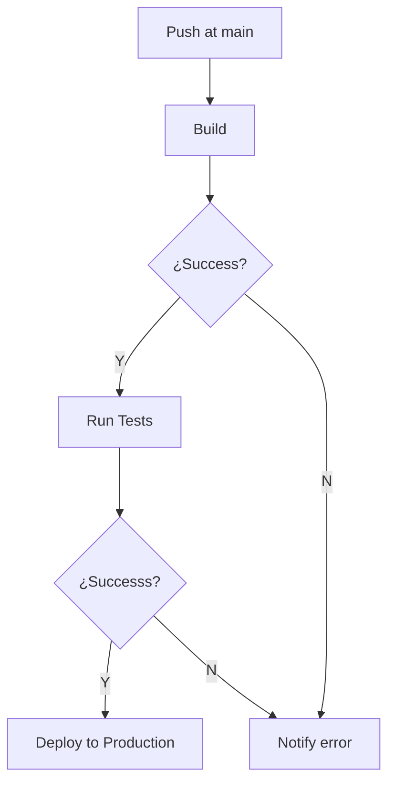

# Documentando el workflow

```mermaid
graph TD
    A[Push at main] --> B[Build]
    B --> C{¿Success?}
    C -->|Y| D[Run Tests]
    C -->|N| E[Notificar error]
    D --> F{¿Successs?}
    F -->|Y| G[Deploy to Production]
    F -->|N| E[Notify error]

```
---
# Otra seccion
